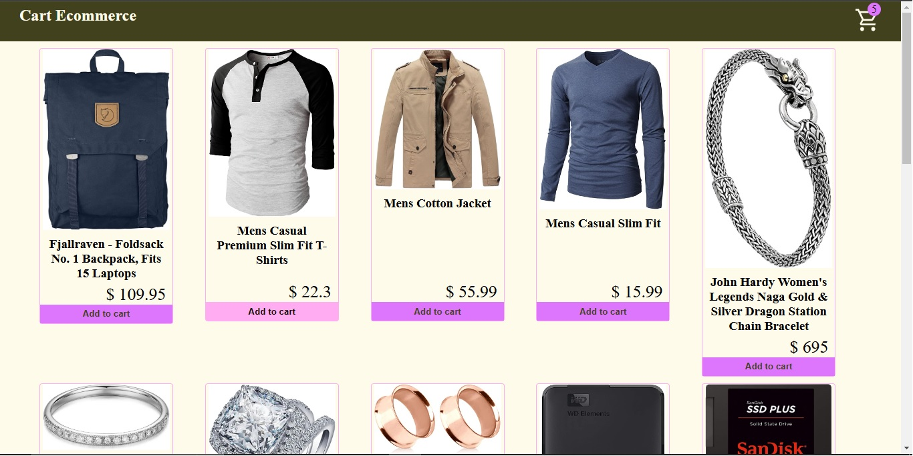

# Badge Cart App 

## Descripción

Este proyecto fue generado usando [Angular CLI](https://github.com/angular/angular-cli) version 19.1.4.

En este ejercicio, se puso el practica el uso de hot observable  BehaviorSubject  para emitir al badge del carrito la información; cada que el usuario le da click al "Add to Cart" se incrementaria un items.

Para mostrar los distintos items o articulos se ha usado la api del sitio: https://fakestoreapi.com/
Debido a la simplicidad del ejercicio no se la ha dado mucha importancia a los estilos con css y demás funciones, pues escapan del objetivo de este ejercicio.

